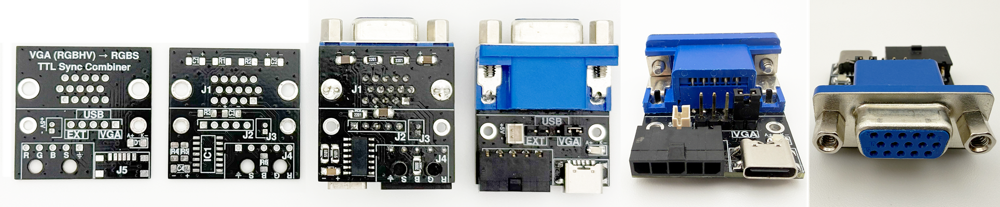
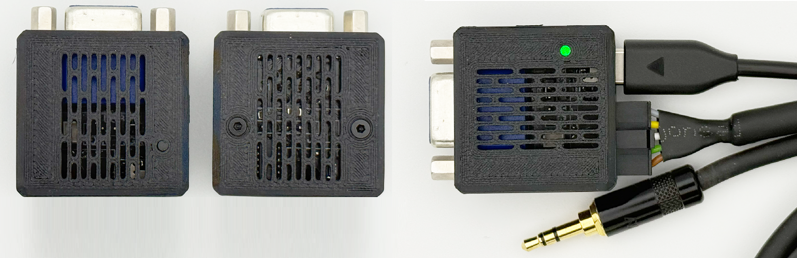

# VGA Sync Combiner for Audi RNS-E, 74HCT86 based


<p align="center">
  
</p>


This project contains a small KiCad PCB for converting a VGA-style RGBHV signal into an RGBS signal suitable for the RGB video input of an Audi RNS-E navigation unit.

The board was designed for use with HDMI-to-VGA adapters or similar VGA/RGBHV sources. It passes the red, green and blue video signals through and combines the separate horizontal and vertical sync signals into one composite sync signal.

The circuit is based on the VGA to RGB+CSYNC adapter by Tomi Engdahl. The PCB is not a direct 1:1 copy of the original TTL output circuit. It adapts the basic 74HCT86 sync-combiner concept for this specific RNS-E use case, including a series resistor on the C-Sync output and practical connector/power options.

## Purpose

The Audi RNS-E RGB input expects RGBS video, while common VGA sources output RGBHV. This board converts the sync part from RGBHV to RGBS by combining H-Sync and V-Sync into one C-Sync signal. The RGB video lines are routed directly through the PCB.

## PCB

The PCB is designed to be hand-solder friendly. It uses larger SMD packages where practical, mainly 1206 passives and an SOIC-14 logic IC. The layout is intended for manual assembly rather than automated production.

The capacitors are MLCC parts, so they are non-polarized and can be soldered in either orientation. This avoids polarity mistakes during manual assembly.

Power for the logic IC can be selected by jumper:

| PCB label | Power source | Description | Notes |
|-----------|--------------|-------------|-------|
| `VGA` | VGA +5V | Via VGA Pin 9 | Requires an HDMI-to-VGA converter that supplies +5V on VGA Pin 9. Not all converters do this. Check the tested converter table before using this option. |
| `USB` | USB-C +5V | Via USB-C connector | Use this option if the converter does not provide +5V on VGA Pin 9. |
| `EXT` | External +5V | Via external JST input | Optional external 5V supply. Check the polarity marked on the PCB before applying power. |

> **Important:** Only one jumper position and one 5V power source must be used at a time. Do not connect multiple 5V sources simultaneously.

A converter may work correctly for video output while still not supplying +5V on VGA Pin 9. In that case, power the PCB through `USB` or `EXT`.

**Only one jumper position and one 5V power source must be used at a time. Do not connect multiple 5V sources simultaneously.**

The external JST input is intended as an optional 5V supply. Its polarity is marked directly on the PCB. Check polarity before applying power.

## Specifications

- Input: VGA RGBHV
- Output: RGBS (Composite Sync)
- Supply voltage: 5 V DC
- Typical current consumption: 15–20 mA
- Supported logic ICs:
  - 74HCT86 (recommended)
  - 74LS86 (supported)
- PCB dimensions: 31 × 31 mm
- PCB thickness: 1.6 mm

## ⚠️ Sync combiner operates without external power

In some setups, the sync combiner may appear to work even when no power supply is connected. This can happen due to backfeeding through the HSync and VSync input signals.

This is unintended behavior and should not be used as a valid power source. Always power the sync combiner from one of the supported 5V inputs.

## Tested (Micro) HDMI to VGA Converters with Raspberry Pi 4B &nbsp;&nbsp;&nbsp; [](https://github.com/noobychris/vga-sync-combiner-audi-rnse/issues/new?labels=compatibility&template=converter_report.yml)

**Recommended converter:**  

> The **Hama Video Adapter HDMI™ Plug to VGA Socket (00200344)** is the recommended option for this PCB. It has been tested successfully and provides +5 V on VGA pin 9, allowing the sync combiner to be powered directly through the VGA connection.
>
> Since the Hama adapter has a standard HDMI plug, a **Micro-HDMI-to-HDMI adapter, cable or compatible Raspberry Pi HDMI connector adapter** is additionally required.

| Converter | HDMI Input | Price* | Result | +5V on VGA Pin 9 | Recommendation | Link |
|-----------|------------|---------|--------|-----------------|----------------|------|
| **Hama Video Adapter HDMI™ Plug to VGA Socket (00200344)** | HDMI | ~17 € | ✅ Working | ✅ Yes | ⭐ **Recommended** | [Hama](https://nordics.hama.com/00200344/hama-video-adapter-hdmi-plug-vga-socket-full-hd-1080p) |
| Official Raspberry Pi Micro-HDMI to VGA Cable | Micro HDMI | ~7 € | ✅ Working | ❌ No | Alternative with external PCB power | [The Pi Hut](https://thepihut.com/products/official-raspberry-pi-micro-hdmi-to-vga-cable) |
| Male Micro HDMI to Female VGA Adapter Active | Micro HDMI | ~4 € | ✅ Working | ❌ No | Alternative with external PCB power | [AliExpress](https://aliexpress.com/item/1005006115048037.html) |
| BENFEI HDMI to VGA Adapter | HDMI | ~7 € | ✅ Working | ❌ No | Alternative with external PCB power | [Amazon](https://www.amazon.de/dp/B075GZ8DX7) |
| Twozoh Micro HDMI to VGA Adapter | Micro HDMI | ~14 € | ⚠️ Occasional picture interruptions | ✅ Yes | Not recommended | [Amazon](https://www.amazon.de/dp/B0CC9CVRDV) |
| Twozoh HDMI to VGA Adapter | HDMI | ~14 € | ⚠️ Occasional picture interruptions | ✅ Yes | Not recommended | [Amazon](https://www.amazon.de/dp/B0BNTPLYZL) |
| Delock Adapter HDMI Micro-D male to VGA female (65470) | Micro HDMI | ~16 € | ❌ Not working at all | ❌ No | Incompatible | [DeLock](https://www.delock.de/produkt/65470/merkmale.html?setLanguage=en) |

\* Prices are approximate and may vary by seller and region.

## Optional EDID installer

This repository also includes an optional `install_edid.sh` script for the Audi RNS-E Raspberry Pi display setup.

The script can install/test EDID files or apply custom `800x480` HDMI timings. It is mainly intended for experimenting with the RNS-E RGB/RGBS video input and different HDMI/VGA or scaler setups.

I have included two `800x480` EDID files for the 193 / 2010 RNS-E:

```text
Karmannsport_RNSE_EDID.bin
pcbbc_Rpi_RNSE_800x480i_EDID.bin
```

## Audi RNS-E Connection

The board was made for an Audi RNS-E RGBS input setup. The RGB and C-Sync output can be wired to the corresponding RNS-E AV/RGB connector pins.
See the [Audi RNS-E pinout](docs/images/rns-e_pinout.jpg) for the connector reference.


## Case

A matching 3D-printable case is included. The case is intended to protect the PCB and make the adapter easier to install in a vehicle or cable harness.

<p align="center">
  
</p>

The case files are located in:

```text
3d_print_case/
├─ vga_sync_combiner.3mf
├─ vga_sync_combiner.stl
└─ 3d_models/
   ├─ vga_sync_combiner_case.step
   └─ vga_sync_combiner_with_all_pcb_parts.step
```


## Repository structure

```text
/
├─ 3d_print_case/
│  ├─ 3d_models/
│  ├─ vga_sync_combiner.3mf
│  └─ vga_sync_combiner.stl
├─ bom/
│  ├─ bom_vga_sync_combiner_for_audi_rns-e_complete.csv
│  └─ bom_vga_sync_combiner_for_audi_rns-e_assembly_service.csv
├─ docs/
│  └─ images/
├─ edid_installer/
│  ├─ edid/
│  │  ├─ Karmannsport_RNSE_EDID.bin
│  │  └─ pcbbc_Rpi_RNSE_800x480i_EDID.bin
│  └─ install_edid.sh
├─ kicad_files/
│  ├─ 3dmodels/
│  ├─ gerber_to_order/
│  │  ├─ vga_sync_combiner_for_audi_rns-e_31.0x31.0mm_for_Default.zip
│  │  ├─ vga_sync_combiner_for_audi_rns-e_31.0x31.0mm_for_Elecrow.zip
│  │  ├─ vga_sync_combiner_for_audi_rns-e_31.0x31.0mm_for_FusionPCB.zip
│  │  ├─ vga_sync_combiner_for_audi_rns-e_31.0x31.0mm_for_JLCPCB.zip
│  │  └─ vga_sync_combiner_for_audi_rns-e_31.0x31.0mm_for_PCBWay.zip
│  ├─ vga_sync_combiner_for_rns-e_footprints.pretty/
│  ├─ vga_sync_combiner_for_rns-e_symbols.kicad_sym
│  ├─ vga_sync_combiner_for_audi_rns-e.kicad_pro
│  ├─ vga_sync_combiner_for_audi_rns-e.kicad_sch
│  ├─ vga_sync_combiner_for_audi_rns-e.kicad_pcb
│  └─ vga_sync_combiner_for_audi_rns-e.kicad_prl
└─ README.md
````

The BOM is located at:

```text
kicad_files/vga_sync_combiner_for_audi_rns-e.csv
```

The BOM also includes parts that are not mounted directly on the PCB, such as cables, crimp contacts, connector housings and jumper/shunt parts. It is therefore intended as a complete project BOM, not necessarily as a direct assembly BOM for PCB assembly services.

## Notes

This board is intended for experimental/custom RNS-E video input builds. It is not an official Audi product and has no relation to Audi.

The original Engdahl circuit is a TTL-level sync combiner. This PCB keeps the 74HCT86-based sync-combiner principle, but the output stage is adapted for this project. Depending on the target device, video source and wiring, the C-Sync output resistor may need adjustment.


## Credits

The sync-combining logic is based on the original [VGA to RGB + composite sync converter](https://www.epanorama.net/circuits/vga2rgbs.html) circuit by Tomi Engdahl, 1993–1996.

The included PCB adapts the concept for an Audi RNS-E RGBS input use case.

<p align="center">
  
</p>

## License

The hardware design files in this repository, including schematics,
PCB layouts, Gerber files, manufacturing files, and documentation,
are licensed under the CERN Open Hardware Licence Version 2 –
Permissive (CERN-OHL-P-2.0).

See the [LICENSE](LICENSE) file for the full license text.
